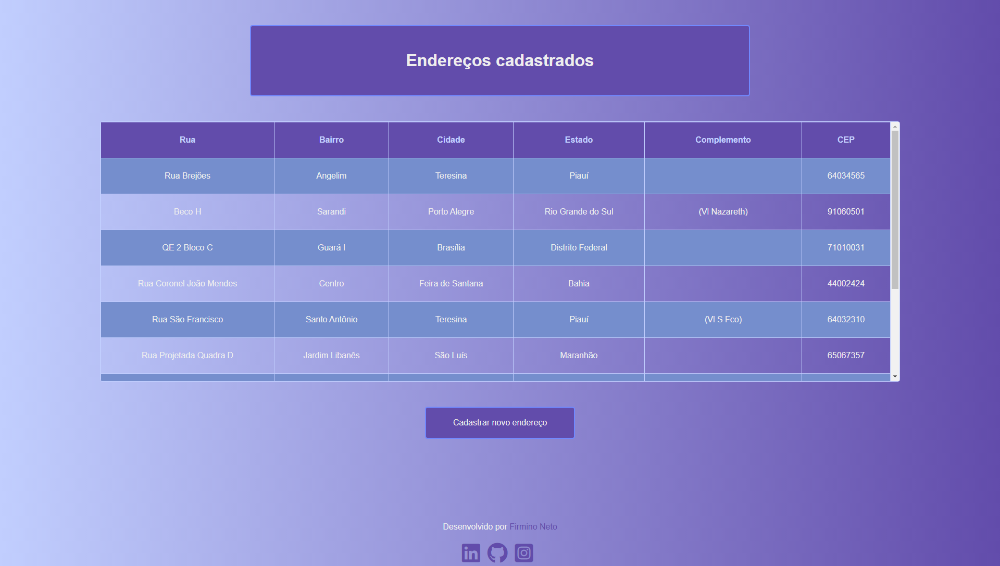
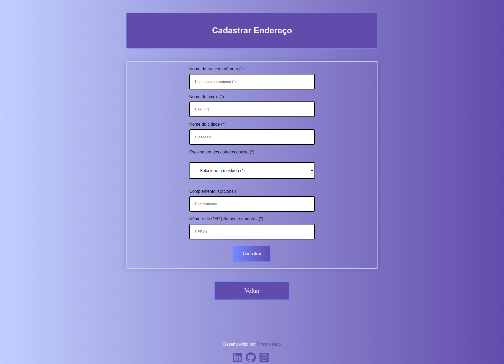

<!--

-->

    <h1>Teste Esoft</h1>
    <h3>Uma aplicação fullstack, utilizando o framework Django e banco de dados SQLite3</h3>

<h2>🤔 Objetivo do projeto 🤔</h2>

Este projeto, é a implementação do teste da empresa E-Soft Sistemas. O teste consiste em uma aplicação web, utilizando o framework Django, para efetuar cadastro de endereços e listagem dos que já estão cadastrados no banco de dados. Implementei uma dupla validação dos dados antes de gravá-los no banco de dados, uma no frontend com a linguagem Javascript e a outra no backend com Python e checagem com os dados da <a href='https://viacep.com.br/'>ViaCep</a> API.

<h2>💻 Tecnologias 💻</h2>

As tecnologias utilizadas neste projeto foram:

- Python
- Django
- SQLite
- HTML
- CSS
- Javascript

No arquivo 'requirements.txt' você pode enconotrar todas as depêndencias para a linguagem Python.

<h2>🚧🚦 Deploy | Demo 🚦🚧</h2>

O deploy do projeto foi feito na plataforma da Heroku, e você pode acessar a demo do projeto em produção, <a href='https://esoft.herokuapp.com/'>aqui</a>.

<h2>👻 Telas 👻</h2>

Tela inicial 👇

Tela de cadastro 👇

<h2>👾 Autor 👾</h2>

Feito com ❤ por <a href=''>Firmino Neto</a>.
